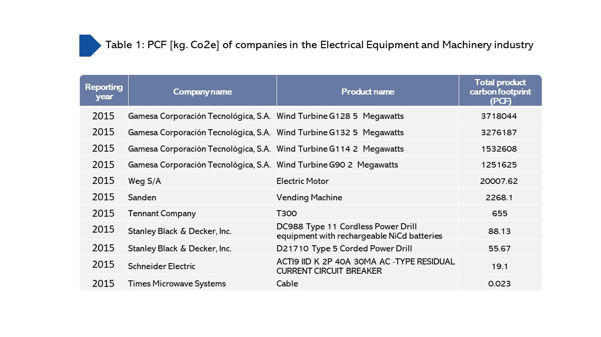

# How does carbon accounting help companies reduce carbon emissions? 
## An analysis using CDP data from 886 commercial products of 145 companies in 30 industry groups across 28 countries

The world has witnessed extreme weather this year - from the raging floods in Pakistan, severe drought in east Africa, and record-breaking heatwaves sweeping across different cities in Europe and China. These events are a stark reminder of the unfolding climate change crisis. To mitigate the impacts of climate change, industry plays a crucial role by reducing its overall carbon emissions. According to the IPCC, it is estimated that industry, transport, and electricity accounted for 76% of total global greenhouse gas (GHG) emissions, while 24% derived from agriculture, forestry, or other land use. 

> Industry, transport, and electricity accounted for 76% of total greenhouse gas (GHG) emissions.

The industry thus adopts climate plans to combat the crisis. According to Jaller and Matthews (2021)[^1], there are two typical strategies - one is to reduce the industry’s future carbon footprint against the emissions levels of the past year, and the other is to improve the process efficiency to generate lesser emissions per unit of production – known as carbon intensity.

Carbon accounting is an essential process for the industry to measure GHG emissions. It allows the industry to identify where and how to reduce emissions along the value chain. Product carbon footprint (PCF) is a commonly used metric to quantify a product’s life cycle carbon emissions, allowing the industry to break down the emissions into “Scopes”. The use of scopes can be categorized as “scope 1” which encompasses emissions under the direct control of the industry, “scope 2” which is the indirect emissions associated with energy consumption, and “scope 3” which relates to the indirect emissions of the entire project life cycle. 

> Carbon accounting allows the industry to identify where and how to reduce emissions along the value chain.

According to the GHG Protocol, scope 3 emissions can be divided based on the industry’s upstream and downstream activities. The emissions from the upstream activities are based on the industry’s raw materials acquisition and production, while emissions from the product’s consumption are regarded as the downstream portion. 

Carbon intensity is defined as the total PCF per product weight. The metric emphasizes both financial benefits and carbon performance to ensure efficient use of resources in the production process as the intensity improvement suggests that the industry implements a more efficient process - an important practice to transition into a more sustainable economy.

The article aims to provide an overview of GHG emissions and identify areas where the industry should focus to improve its carbon emissions reduction strategies by looking at the GHG emissions from carbon footprint data reported to CDP (formerly the Carbon Disclosure Project) from 2013-2016. The dataset[^2] contains 886 commercial products from 145 companies in 30 industry groups across 28 countries. 

**Figure 1** illustrates each industry's cumulative product PCF from 2013-2017. It points out that the PCF attributable to the manufacturer of Electrical Equipment and Machinery was the largest carbon emissions contributor, with almost 10 million kg. CO2 equivalent, despite having lesser representation in the dataset than other industry groups. 

**Table 1** shows the PCF of each product in the Electrical Equipment and Machinery industry. Surprisingly, the Spanish company “Gamesa Corporación Tecnológica, S.A.”, specializing in wind energy production, appeared to be the biggest contributor to GHG emissions. The emissions from wind turbine production in 2015 alone totted up to 9.77 million kg. CO2 equivalent.

Although the emissions of upstream and downstream activities are not available in the dataset to analyze the origin of emissions, it is reported that upstream raw materials needed for wind turbine production such as steel, aluminum, and epoxy resins are the largest sources of GHG emissions.[^3]

However, it is important to note that, as compared to other energy sources like coal-fired, natural gas, and solar energy, wind power generates a significantly lesser carbon footprint over the product’s life span[^4] and is widely encouraged to counter the climate crisis. To better track GHG emissions from the production process, carbon intensity is adopted by various entities to identify areas of improvement. 

**Figure 2** depicts the normalized distribution of carbon intensity of each industry group from 2013-2017. The distribution is normalized between the highest value and lowest value in each year. Due to insufficient reported product-level data, only certain industry groups were shown. 

The chart shows that Technology Hardware & Equipment had the highest carbon intensity, with a value of 1, whereas Electrical Equipment and Machinery had considerably lower carbon intensity. This pattern indicates that the Technology Hardware & Equipment industry generates a large volume of emissions per unit of products. Reducing the carbon intensity means that the industry needs to better manage resources to maximize the value of resources used in the production process.

**Table 2** details the breakdown of total PCF into upstream activities, downstream activities, and operations (in the percentage of total PCF) of the selected five most PCF contributors in the Technology Hardware & Equipment industry. It suggests that most of a company’s GHG emissions are likely to occur in their downstream supply chain. Hence, companies should focus their GHG reduction efforts on the emissions occurring during the product’s use phase and end-of-life treatment such as reducing energy consumption during the use phase and implementing a recycling policy.

Many studies have shown the benefits of emissions reduction. This article points out the importance of PCF and carbon intensity to quantify GHG emissions and identify areas of improvement in the product’s value chain. 

The PCF studies allow a company to analyze the breakdown of a product’s life cycle emissions, while carbon intensity-based metrics determine whether the resources used in the production process are optimized. To achieve net-zero emissions, significant adjustments are requisite. A company can thus yield an insight analysis to reduce inefficiencies and foster innovative solutions. 

[^1]: Jaller, M., Matthews, S., Can Carbon Intensity Metrics Help Achieve Net Carbon Reductions?
[^2]: Meinrenken, C.J., Chen, D., Esparza, R.A. et al. The Carbon Catalogue, carbon footprints of 866 commercial products from 8 industry sectors and 5 continents. Sci Data 9, 87 (2022). 
[^3]: How Green Is Wind Power, Really? A New Report Tallies Up The Carbon Cost Of Renewables (forbes.com)
[^4]: How Green Is Wind Power, Really? A New Report Tallies Up The Carbon Cost Of Renewables (forbes.com)